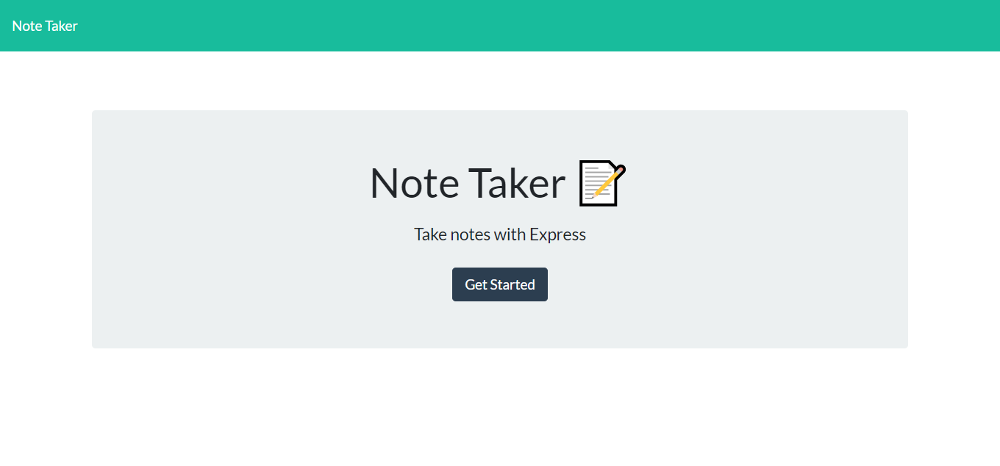
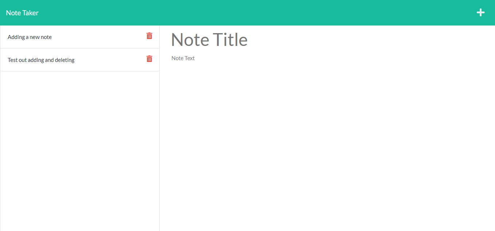

# Note Taker

  

  ## Description

  This is an application using Express.js to host notes on a remote server.  It features the ability to read, write, and delete notes.

  ## Table of Contents

  - [Installation](#installation)
  - [Usage](#usage)
  - [License](#license)
  - [Questions](#questions)

  ## Installation

  The application is deployed live on [Heroku](https://desolate-retreat-85020.herokuapp.com) or can be hosted locally by cloning this repository, running "npm install", then "node server".  It will run on port 3001 on localhost.

  ## Usage

  This should be used to keep track of any notes that you will want to access later.

  ## License

  This software provided under the [MIT license](LICENSE.txt).
  

  ## Questions

  If you have any questions or concerns, feel free to contact me via my [Github](https://github.com/zk229) or via [email](mailto:zkirsche229@gmail.com).
  
  ## Screenshots
  
  
  
  
